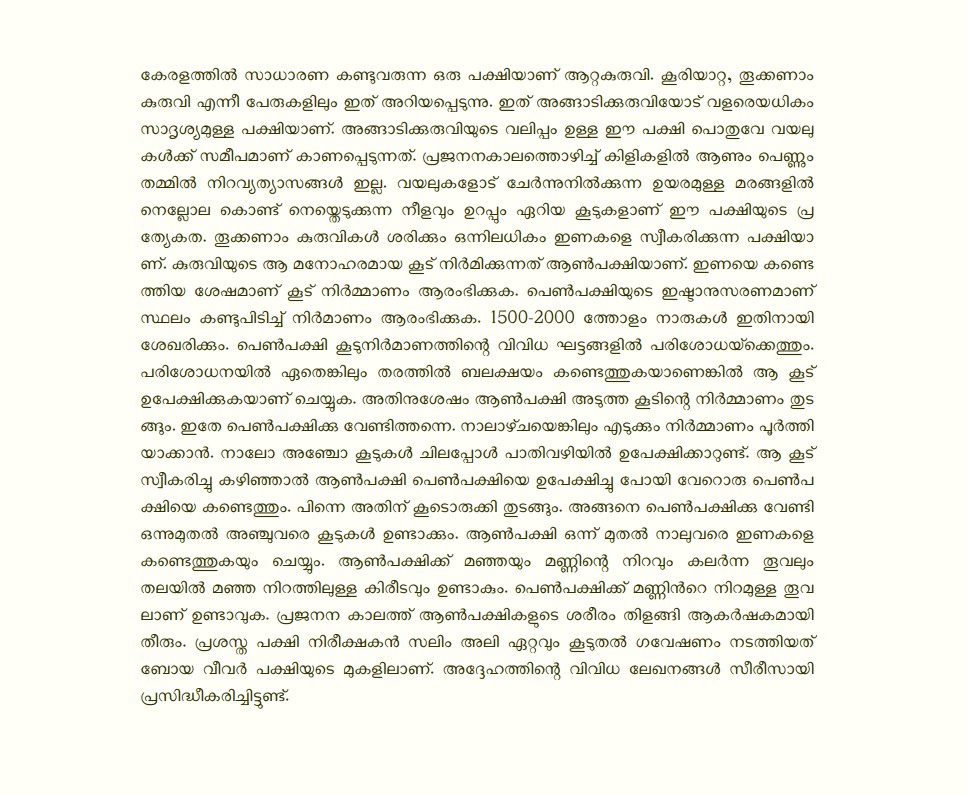

# Malini Malayalam Typeface

A Malayalam variable typeface optimized for body text



Taking full advantage of variable font technology, Malini offers an unprecedented level of flexibility, all from a single font file. Malini has 4 variable axes: `Weight`, `Width`, `Slant` and `Optical Size`.

As a variable font, Malini gives you fine-grained control over each one of its styles. However, it also comes with 64 predefined styles that are easy to access through your font menu. Called *named instances¹*, these work just like regular static fonts do.

¹ *Named instance*: a predetermined location in the designspace of a variable font, similar to the "static instances" that are familiar in traditional digital fonts.

The Variable font capability makes Malini stylistically flexible and warmly energetic.

Malini is also available as multiple fonts with different weights.


## Variation axes

Malini has the following axes:

| Axis       | Tag    | Range        | Default | Description                                                     |
| ---------- | ------ | ------------ | ------- | --------------------------------------------------------------- |
| Weight  | `wght` | 100 to 900       | 400       | Thin to Black. Can be defined with usual font-weight property.                      |
| Slant     | `slnt` | -15 to 0       | 0       | Upright (0°) to Slanted (about 15°)                                                |
| Width     | `wdth` | 75 to 125  | 100     | Condensed to Expanded. Can be defined with usual font-stretch property. |
| Optical Size     | `opsz` | 10 to 100  | 20     | Follows the font size to optimize the contrast and spacing |

### Axis Definitions

* **Weight** `wght`: 100 to 900. The overall thickness of letters and the darkness of text composed with them.

    Recommended use: Differences in weight can provide emphasis in text, show user interaction, or adjust the tone of communication. For light text on dark backgrounds, 400 (“Regular”) tends to be appropriate for text and code. For dark text on a light background, it can be beneficial to adjust the weight upwards to 500 (“Medium”).

* **Slant** `slnt`: 0 to -15. The "forward lean" of letters. Note: -15 (negative 15) corresponds to a 15° clockwise slant, due to type design's roots in geometry.

    Recommended use: The Malayalam script with its glyph characteristics does not have an established slant behavior. Mostly we mimic the slanting in latin. And we often call italic. Note that italic and slant are not same.  Use Slant as a secondary way to emphasize text or vary typographic tone. In text, it can be useful to use a partial slant of around -12.

* **Width** `wdth`: 75 to 125%. The percentage of letter width. 75% is 'Condensed', where the letters are horizontally condensed to 75% of original width. 125% is 'Expanded' where the letters are horizontally stretched to 125% of original width.

    Recommended use: The condense or expand can be used to achieve precise typographic layout in a predefined rendering space. The content can be adjusted in this way to "fit" the space. Be aware of the legibility degradation when doing this.
* **Optical size** `opsz`: 10 to 100. The contrast, spacing are adjusted to the current font size. In smaller sizes, glyphs will have less contrast and loose text. In larger font sizes, glyphs will have high contrast and tight spacing.

    Recommended use: Browsers will automatically choose the the correct opsz value as per font size. To disable that `font-optical-sizing: none` can be used. It is also possible to manually set an `opsz` value to the `font-variation-settings`


## Using the fonts

* Download the latest fonts from the [Releases](https://gitlab.com/smc/fonts/Malini/-/releases/) (Look under the "Assets" of the latest release, download the zip, and then open that zip)
* Install the fonts on your system. Depending on the Operating system, the installation steps vary. In general, Clicking on the font file give the option to install it.

### Using Variable font in web pages

Varibale fonts save bandwith in web pages by having a single font to download, while providing all style variations. Using them on webpages is a big topic. Please use a [good tutorial like MDN](https://developer.mozilla.org/en-US/docs/images/Web/CSS/CSS_Fonts/Variable_Fonts_Guide)

In general, you should link in the font with @font-face

```css
@font-face {
 font-family: 'Malini';
 src: url('path/to/font/Malini-VF.woff2') format('woff2-variations');
 font-weight: 100 900;
 font-stretch: 75% 125%;
 font-style: oblique 0deg -15deg;
}
```

Then, you can use the font with both `font-weight` and `font-variation-settings`. Using CSS [custom properties will help](https://pixelambacht.nl/2019/fixing-variable-font-inheritance/) to avoid some caveats of property inheritance.

## Building the fonts

Install the required software packages, assuming a debian based GNU/Linux Operating system

```bash
apt-get update -y
apt-get install -y make python3-pip python3-venv python3-yaml texlive-metapost libharfbuzz-bin
```

To build, set up the virtual environment and activate it.

```bash
virtualenv -p python3 venv
source venv/bin/activate
```

Then install requirements:

```bash
pip install -U -r requirements.txt
```

Then run make to build everything

```bash
make
```

This will take more than 15 minutes to build everything. But if you have a multi core processor, you can speed up this by using parallel build. Assuming you have 8 core system(8 CPUs)

```
make -j8
```

A directory named fonts will be generated.

## Language support

Malini is primarily a Malayalam font. All the Malayalam characters defined in Unicode version 15 are present in the font. Malini also has latin script support. So Malini supports 39 languages:

Afrikaans, Albanian, Basque, Bosnian, Catalan, Croatian, Czech, Danish, Dutch, English, Estonian, Faroese, Filipino, Finnish, French, Galician, German, Hungarian, Icelandic, Indonesian, Irish, Italian, Latvian, Lithuanian, Malay, Malayalam, Norwegian Bokmål, Polish, Portuguese, Romanian, Slovak, Slovenian, Spanish, Swahili, Swedish, Tongan, Turkish, Welsh and Zulu.


## Credits

See [FONTLOG.md](FONTLOG.md) for details on contributions.

## Contributing

See [CONTRIBUTING.md](CONTRIBUTING.md) for policies around contributing to the project.

## License

This Font Software is licensed under the SIL Open Font License, Version 1.1. This license is available with a FAQ at: https://scripts.sil.org/OFL
